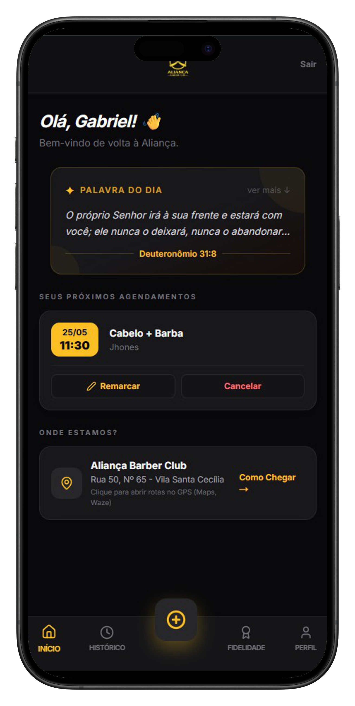
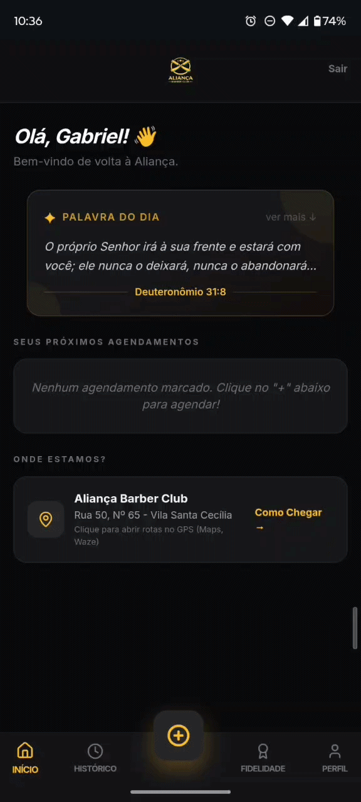
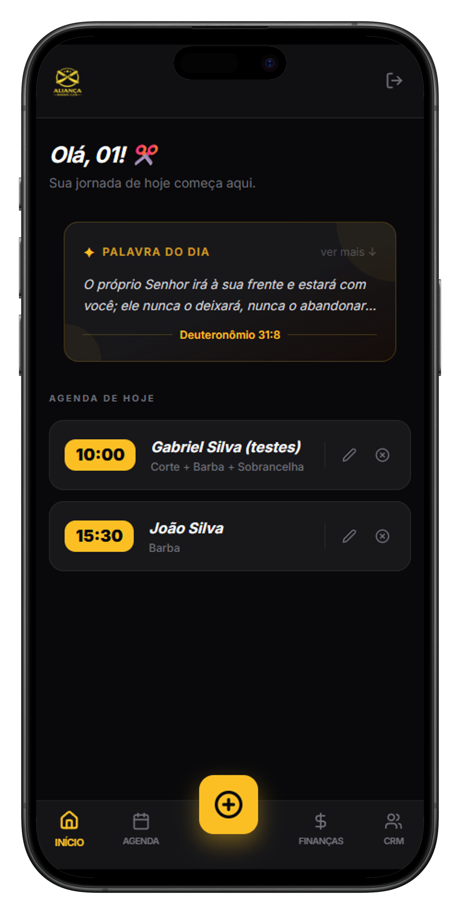

# ✂️ Aliança Barber System - SaaS de Agendamento & Gestão Comercial

[](https://nextjs.org/)
[](https://supabase.com/)
[](https://tailwindcss.com/)
[](https://www.typescriptlang.org/)

> **Status do Projeto:** 🚀 MVP Funcional em Produção (Versão 1.0)
> **Link do App Vivo:** [Acesse a aplicação aqui](https://alianca-barber-club-swart.vercel.app/)

---

## 📄 Sobre o Projeto

O **Aliança Barber System** é um ecossistema SaaS completo (Software as a Service) de agendamento e gestão comercial desenvolvido para dispositivos móveis (_Mobile-First_). O sistema foi projetado para resolver dores reais de gerenciamento de agendas, ociosidade de profissionais, controle de fluxo de clientes (CRM) e autonomia operacional de barbearias que operam sob o modelo de sociedade.

Ao contrário de soluções genéricas de agendamento, este software valida regras de negócio complexas de concorrência de horários e fornece painéis customizados e isolados para cada nível de acesso (Clientes, Barbeiros e Administradores).

---

## 🎯 Funcionalidades Principais

### 🔒 Autenticação e Segurança (RBAC)

- **Controle de Acesso Baseado em Nível (Role-Based Access Control):** Redirecionamento dinâmico via Middleware do Next.js. Clientes, Barbeiros e Admins possuem fluxos e proteções de rotas totalmente isolados.
- **Recuperação de Senha Autônoma:** Fluxo integrado com envio de e-mail transacional via Supabase Auth, permitindo reset seguro de credenciais sem intervenção manual do administrador.

### 📱 Experiência do Cliente (Área do Cliente)

- **Stepper de Agendamento Guiado:** Fluxo intuitivo em 3 passos (Escolha do profissional ➔ Seleção do serviço com preço em tempo real ➔ Seleção de data/hora).
- **Painel de Controle de Agendamentos:** Visualização clara de compromissos futuros e histórico de visitas.
- **Remarcação Inteligente (Sem Fricção):** O cliente pode alterar a data ou horário de um agendamento existente com base na disponibilidade do barbeiro, sem a necessidade de cancelar e recriar o processo do zero.
- **Cancelamento com Notificação Integrada:** Fluxo de cancelamento simplificado que dispara uma ponte direta com o WhatsApp do profissional responsável.
- **Atualização de Perfil (CRM):** Edição de dados de contato e data de nascimento para campanhas futuras de fidelização.

### 💈 Gestão da Agenda (Painel do Barbeiro)

- **Visão Diária e Semanal:** Listagem cronológica dos clientes agendados para o dia e controle dos próximos compromissos da semana.
- **Agendamento Manual Integrado:** Permite ao barbeiro cadastrar clientes que agendam por canais externos (como chamadas ou mensagens diretas), mantendo a integridade do banco de dados.
- **Bloqueio de Horários Inteligente:** Ferramenta para o profissional bloquear horários específicos ou dias inteiros (folgas/compromissos), indisponibilizando os slots automaticamente na visão do cliente.
- **Controle Operacional Total:** Autonomia para o barbeiro remarcar e cancelar horários diretamente pelo painel para dar suporte a clientes com dificuldades técnicas.

---

## 📱 Interface Visual

<p align="center">
  
  
  
</p>

---

## 🛠️ Stack Tecnológica

- **Frontend:** [Next.js 14+](https://nextjs.org/) (App Router) com React Hooks para gerenciamento de estados.
- **Estilização:** [Tailwind CSS](https://tailwindcss.com/) com design focado em modo escuro (_Blackout Premium Aesthetic_).
- **Backend as a Service (BaaS):** [Supabase](https://supabase.com/) gerenciando autenticação e persistência de dados.
- **Banco de Dados:** [PostgreSQL](https://www.postgresql.org/) com relacionamentos estruturados e integridade referencial.
- **Ícones:** [Lucide React](https://lucide.dev/) para uma interface limpa e moderna.

---

## 🧠 Desafios de Engenharia & Soluções Aplicadas

Durante o desenvolvimento deste SaaS, foram aplicados padrões avançados de engenharia para contornar limitações de navegadores móveis e otimizar a experiência do usuário final:

1. **Bypass de Bloqueadores de Pop-ups em Dispositivos Móveis:**
   - _Desafio:_ Navegadores mobile (como o Safari no iOS) bloqueavam as janelas abertas via `window.open` após requisições assíncronas ao banco de dados, quebrando o redirecionamento para o WhatsApp.
   - _Solução:_ Migração da arquitetura de redirecionamento para manipulação direta de `window.location.href` utilizando a API oficial do WhatsApp (`api.whatsapp.com/send`), garantindo compatibilidade universal de 100% em qualquer sistema operacional móvel.

2. **Otimização de Interface Sem Rolagem (True Mobile-First UX):**
   - _Desafio:_ Formulários de autenticação costumam gerar barras de rolagem desnecessárias em telas menores, prejudicando a sensação de "aplicativo nativo".
   - _Solução:_ Ajuste cirúrgico na escala de componentes visuais (logos e paddings) utilizando unidades relativas do Tailwind, travando o viewport e distribuindo os elementos proporcionalmente sem quebras.

3. **Gerenciamento de Slots e Concorrência de Horários:**
   - _Desafio:_ Evitar o agendamento duplo e garantir que o próprio cliente possa reajustar seu horário sem que o sistema interprete que o slot atual dele está ocupado por outra pessoa.
   - _Solução:_ Filtros dinâmicos em consultas assíncronas do Supabase que isolam o ID do agendamento atual durante a validação de disponibilidade de slots.

---

## 📐 Modelo de Dados (Estrutura Principal)

O banco de dados relacional PostgreSQL no Supabase foi modelado da seguinte forma para suportar o ecossistema:

- `profiles`: Armazena os dados de usuários (Clientes, Barbeiros e Administradores) atrelados ao Supabase Auth UUID.
- `barbers`: Relaciona os perfis dos profissionais com suas informações comerciais (Ex: número do WhatsApp).
- `appointments`: Tabela central contendo os registros de agendamentos, serviços, datas, horas e status (`confirmed`, `canceled`).
- `blocked_dates`: Registros de datas ou períodos bloqueados de forma manual pelos profissionais.

---

## 🏁 Como Executar o Projeto Localmente

1. Clone o repositório:

   ```bash
   git clone [https://github.com/gsilvatech/alianca-barber-club.git](https://github.com/gsilvatech/alianca-barber-club.git)

   ```

2. Instale as dependências:

   ```bash
   npm install

   ```

3. Configure as variáveis de ambiente. Crie um arquivo **.env.local** na raiz do projeto e adicione suas credenciais do Supabase:

   ```
   NEXT_PUBLIC_SUPABASE_URL=sua_url_do_supabase
   NEXT_PUBLIC_SUPABASE_ANON_KEY=sua_chave_anon_do_supabase
   ```

4. Inicie o servidor de desenvolvimento:

   ```bash
   npm run dev

   ```

5. Abra http://localhost:3000 no seu navegador.

👨‍💻 Desenvolvido por
Gabriel Ferreira - Idealizador e Desenvolvedor Full Stack

GitHub: @gsilvatech

Instagram: @sougabrieloficial
